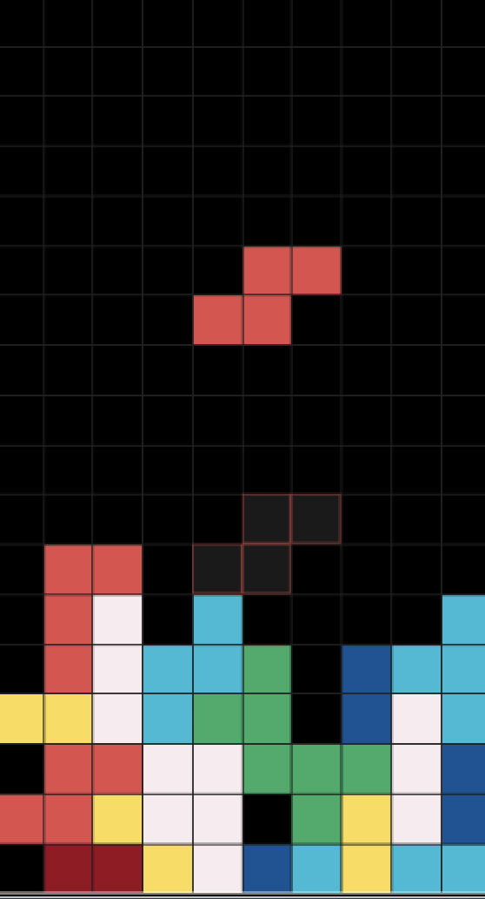

# React Tetris

> Tetris with ReactJS with complete compatibility

## Live

<h1 align="center">
  
</h1>

## Building

You'll need [Node.js](https://nodejs.org) installed on your computer in order to build this app.

```bash
$ git clone https://github.com/mpirescarvalho/react-tetris.git
$ cd react-tetris
$ npm install
$ npm run start
```

Runs the app in the development mode.<br/>
